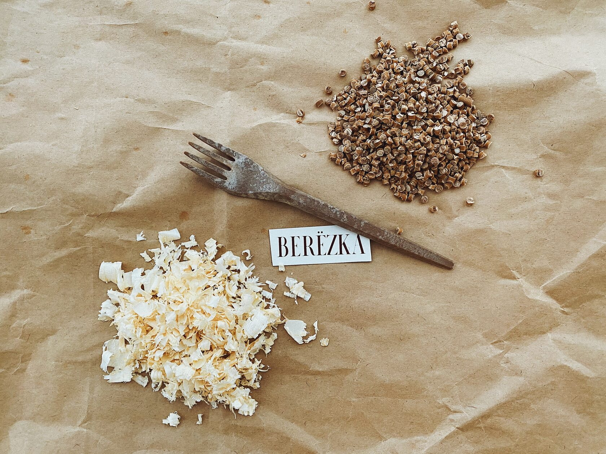

# BERЁZKA
Once upon day we finished another cup of coffee, threw it away, and thought: How many people on the planet do this every day? How many hundreds of millions of cups lie in landfills around the world? In how many billions of years will they disintegrate? They thought about it and decided to make another cup.

# BERЁZKA
Once upon day we finished another cup of coffee, threw it away, and thought: How many people on the planet do this every day? How many hundreds of millions of cups lie in landfills around the world? In how many billions of years will they disintegrate? They thought about it and decided to make another cup.

## We made dishes that don't harm
Our cups, lids, forks and plates are special. We make them from sawdust and biopolymer. It was difficult to make such a strong and flexible material without petrochemical products, and so far we are the only ones in Russia who use this technology. But we believe that soon we will grow out of our «startup» status, because we are not the only ones who dream of leaving a living planet to children!

## What makes our tableware unique?
It contains no petrochemicals at all, not even polypropylene. Polypropylene is added to natural compositions like starch, so that the raw material does not fall apart when exposed to high temperatures. For the most part, this is how «eco-friendly» cookware is made in Russia. But this is not saving the planet. Polypropylene takes the same 500 years to decompose as large particles of plastic. But it ends up in our lungs, and cannot be collected and recycled.

## Get in touch
We'll tell you everything! (Well, almost everything ;))
E-Mail: [info@woodcup.ru]

[Video](https://youtu.be/wOpuOQyJIIU)

 [info@woodcup.ru]: <mailto:semenov.int@gmail.com>

## We made dishes that don't harm
Our cups, lids, forks and plates are special. We make them from sawdust and biopolymer. It was difficult to make such a strong and flexible material without petrochemical products, and so far we are the only ones in Russia who use this technology. But we believe that soon we will grow out of our «startup» status, because we are not the only ones who dream of leaving a living planet to children!

## What makes our tableware unique?
It contains no petrochemicals at all, not even polypropylene. Polypropylene is added to natural compositions like starch, so that the raw material does not fall apart when exposed to high temperatures. For the most part, this is how «eco-friendly» cookware is made in Russia. But this is not saving the planet. Polypropylene takes the same 500 years to decompose as large particles of plastic. But it ends up in our lungs, and cannot be collected and recycled.

## Get in touch
We'll tell you everything! (Well, almost everything ;))
E-Mail: [info@woodcup.ru]

[Video](https://youtu.be/wOpuOQyJIIU)

 [info@woodcup.ru]: <mailto:semenov.int@gmail.com>